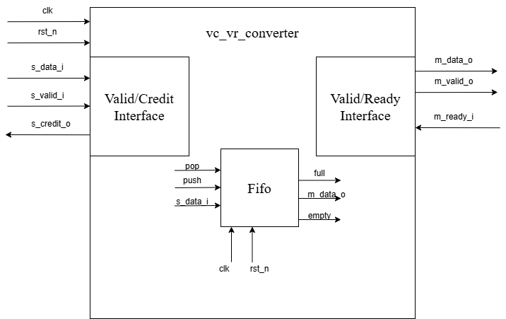

# Преобразователь valid/credit интерфейса в valid/ready интерфейс.

## Описание работы основного модуля 

Модуль vc_vr_converter реализует преобразователь интерфейса *valid/credit* в *valid/ready*, используя внутреннюю FIFO-очередь фиксированной глубины *CREDIT_NUM*. Это позволяет принимать данные с интерфейса *valid/credit*, временно буферизовать их, и выдавать на интерфейс *valid/ready*.

После *rst_n*,  *s_credit_o* стоит в активном уровне столько тактов, сколько крдеитов доступно. Это делается при помощи счётчика, то есть при *rst_n*, *reset_credit_counter* сбрасывается, а после считает до *CREDIT_NUM* - 1. Так же 

* Прием данных (valid/credit → FIFO)
    Данные с *s_data_i* записываются во внутреннюю FIFO, если:

    Сигнал *s_valid_i* == 1 (входные данные валидны)

    Очередь не переполнена (full == 0)

    Управляется через сигнал *push = s_valid_i && !full*

* Передача данных (FIFO → valid/ready)

    Если FIFO не пуста (empty == 0), данные извлекаются через сигнал pop, при условии:

    `m_ready_i == 1` (приемник готов)

    `m_valid_o == 1` (данные валидны)

    `pop = m_valid_o && m_ready_i`

* Управление сигналами
    
    m_valid_o Активен, когда FIFO не пуста:

    `assign m_valid_o = !empty;`

    s_credit_o Активен в двух случаях:

    Когда был произведён pop, но при этом не было нового push

    Пока счетчик инициализации кредитов (reset_credit_counter) меньше CREDIT_NUM

    `assign s_credit_o = (pop && !push) || credit_reset;`
    
    credit_reset Активен только во время инициализации модуля (пока не пройдено CREDIT_NUM тактов)

    `credit_reset <= (reset_credit_counter < CREDIT_NUM);`

## Внутренние компоненты

FIFO очередь глубиной CREDIT_NUM, реализующая буферизацию данных.

Счетчик reset_credit_counter, инициализирующий возврат начальных CREDIT_NUM кредитов.

Сигналы управления: push, pop, full, empty, credit_reset.

## Поведение на сбросе
* При сбросе (rst_n == 0):

    Счетчик кредитов reset_credit_counter и credit_reset обнуляются

    FIFO сбрасывается

* После сброса:

    В течение CREDIT_NUM тактов на выходе s_credit_o выдается 1 — тем самым возвращаются начальные кредиты отправителю.

## Модуль Fifo 
* FIFO реализована как кольцевой буфер (fifo_q), в котором поддерживаются два указателя:

    *write_pointer_q* — указывает на позицию для следующей записи

    *read_pointer_q* — указывает на текущую позицию чтения

* Проверка состояний:

    *empty_o* устанавливается, когда указатели записи и чтения равны — очередь пуста.

    *full_o* устанавливается, когда младшие биты указателей равны, но старшие (переполнение) различаются — очередь полна.

* Запись (push)

    Если *push_i* активен и очередь не полна:

    Входные данные *data_i* записываются по адресу *write_pointer_q*. Указатель записи увеличивается. Буфер *fifo_q* обновляется (переписывается из временного *fifo*).

* Чтение (pop)

    Если *pop_i* активен и очередь не пуста:

    Указатель чтения увеличивается. Данные *data_o* всегда содержат текущее значение по адресу *read_pointer_q*.

